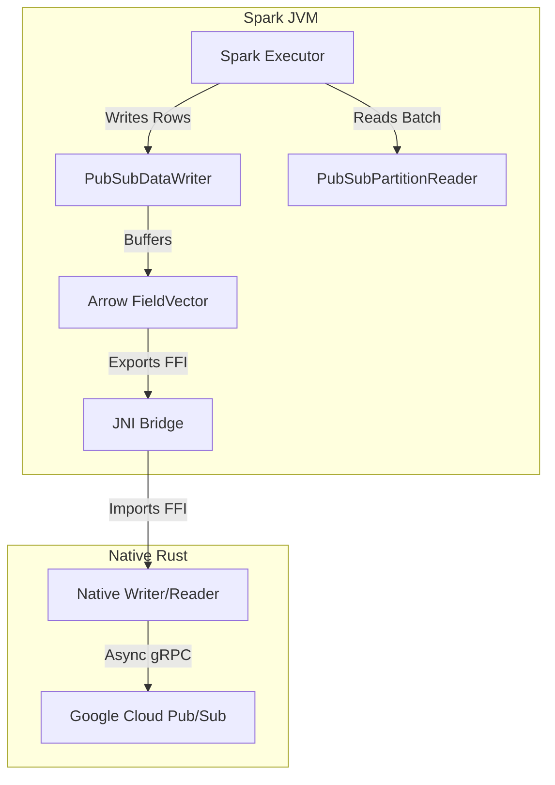

# Spark Pub/Sub Connector Architecture

## 1. System Overview
The Spark Pub/Sub Connector is a high-performance, native integration between Apache Spark (Structured Streaming) and Google Cloud Pub/Sub. It leverages **Apache Arrow** and **Rust** to achieve near-zero-copy data transfer and low-latency message processing.

### Key Goals
- **High Throughput**: Bypasses the JVM Pub/Sub client in favor of a native Rust `tonic` (gRPC) implementation.
- **Zero-Copy Serialization**: Uses the **Arrow C Data Interface** (FFI) to pass data between the JVM (Spark) and Native (Rust) layers without expensive serialization/deserialization steps.
- **Type Safety**: Centralized type mapping guarantees consistency between Spark SQL types and Arrow vectors.

---

## 2. High-Level Architecture
The system is composed of two primary layers:

1.  **Spark Control Plane (Scala/JVM)**:
    - Implements Spark's `DataSourceV2` API.
    - Handles query planning, partition management, and schema inference.
    - Manages the lifecycle of native resources via JNI.

2.  **Native Data Plane (Rust)**:
    - Executes heavy I/O operations (Pub/Sub Publish/Subscribe).
    - Manages gRPC connections and authentication (ADC).
    - Converts Protobuf messages to Arrow Inteface structures (`FFI_ArrowArray`, `FFI_ArrowSchema`).

---

## 3. Core Modules

### 3.1. Read Path (Spark -> Pub/Sub)
**Class**: `PubSubMicroBatchStream`, `PubSubPartitionReader`
**Flow**:
1.  **Planning**: `PubSubMicroBatchStream` defines input partitions based on configuration (Subscription ID).
2.  **Execution**: `PubSubPartitionReader` initializes a `NativeReader` via JNI.
3.  **Fetch**:
    - `reader.getNextBatch` is called.
    - Rust performs a `StreamingPull` from Pub/Sub.
    - Rust converts `PubsubMessage`s into an `Arrow StructArray`.
    - Rust exports the array pointer via the C Data Interface.
4.  **Consumption**:
    - Scala imports the pointer into a `VectorSchemaRoot`.
    - `ArrowUtils.getValue` maps Arrow types to Spark `InternalRow`s.

### 3.2. Write Path (Pub/Sub -> Spark)
**Class**: `PubSubDataWriter`
**Flow**:
1.  **Buffering**: Rows are written to `PubSubDataWriter`, which buffers them into local Arrow `FieldVector`s using `ArrowUtils.setValue`.
2.  **Flush**: When the buffer is full (configured batch size), `writeBatch` is invoked.
3.  **Export**:
    - Scala exports the local Arrow Vector to a C-compatible struct (`FFI_ArrowArray`).
    - **Critical**: Scala calls `close()` on the local root, while Rust takes a reference.
4.  **Publish**:
    - Rust imports the FFI struct (Reference count +1).
    - Rust converts Arrow rows to `PubsubMessage`s.
    - Messages are published asynchronously via `tonic`.
    - Rust drops the imported struct (Reference count -1), satisfying memory safety.

---

## 4. Key Process Flows

### 4.1. FFI Ownership Model (Reference Counting)
We discovered that Java's Arrow implementation uses **Reference Counting**, not strict "Move" semantics (as in C++ `std::move`).

- **Incorrect Approach**: Zeroing out the source pointer triggers a JVM crash/panic because the Java side still expects the struct to exist for its own metadata.
- **Correct Approach**:
    - **Java**: Allocate -> Export -> Call `close()` (Decrements local ref).
    - **Rust**: Import (Increments ref) -> Process -> Drop (Decrements ref).
    - **Result**: Memory is freed when the count reaches zero.

### 4.2. Centralized Type Mapping (`ArrowUtils.scala`)
All type conversions are centralized to ensure consistency.
- **Support**: `Binary`, `String`, `Timestamp`, `Boolean`, `Int`, `Long`, `Float`, `Double`, `Short`, `Byte`.
- **Logic**: Maps Spark `DataType` to specific Arrow `FieldVector` implementations (e.g., `StringType` -> `VarCharVector`).

---

## 5. Build Structure (Multi-Module)
To support Spark 4.0 (Scala 2.13) alongside Spark 3.5 (Scala 2.12), the project uses a multi-module `build.sbt`:

- **`spark3`**: Targets Scala 2.12 / Spark 3.5 (Production).
- **`spark4`**: Targets Scala 2.13 / Spark 4.0 (Experimental/Preview).
- **`common`**: Both modules share source code from `src/main/scala` via `unmanagedSourceDirectories`.

---

## 6. Native Library (`native/`)
- **Crate**: `native_pubsub_connector`
- **Dependencies**: `arrow`, `tonic`, `tokio`, `google-cloud-pubsub`.
- **Safety**: Uses `unsafe` blocks only for FFI bridges, documented with safety invariants.
