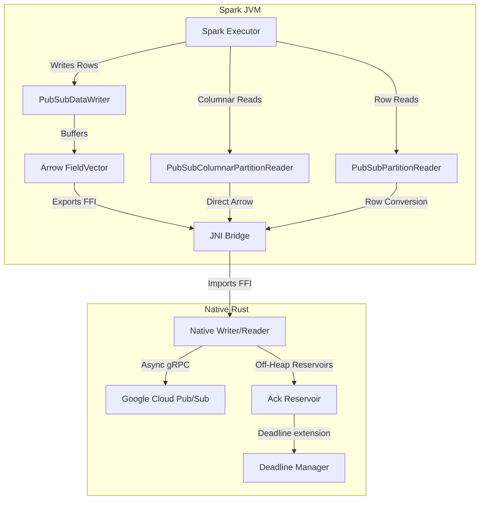

# Spark Pub/Sub Connector Architecture

This document provides a comprehensive overview of the Spark Pub/Sub connector's architecture, including its systems design, core modules, technical implementation details, and stability patterns.

---

## 1. Design Philosophy: Convention over Configuration

The Spark Pub/Sub Connector is designed to "just work" for 90% of use cases without manual tuning.
- **Intelligent Defaults**: Parallelism, batching, and authentication are automatically inferred from the environment.
- **Unified Schema**: A single entry point handles both raw message access and high-performance native JSON/Avro parsing.
- **ADC-First**: Prioritizes Google Application Default Credentials for seamless GKE/Dataproc integration.

---

## 2. System Overview

The Spark Pub/Sub Connector is a high-performance, native integration between Apache Spark (Structured Streaming) and Google Cloud Pub/Sub. It leverages **Apache Arrow** and **Rust** to achieve near-zero-copy data transfer and low-latency message processing.

### Key Goals
- **High Throughput**: Bypasses the JVM Pub/Sub client in favor of a native Rust `tonic` (gRPC) implementation.
- **Zero-Copy Serialization**: Uses the **Arrow C Data Interface** (FFI) to pass data between the JVM (Spark) and Native (Rust) layers without excessive overhead.
- **Strictly At-Least-Once**: Native Reservoirs with background deadline management prevent message expiry during complex Spark processing.
- **Multi-Spark Version Support**: Native binary portability across Spark 3.3, 3.5, and 4.0.

---

## 2. High-Level Architecture

The system employs a "split-brain" approach to balance Spark's control plane with the performance requirements of a native data plane.

1.  **Spark Control Plane (Scala/JVM)**:
    - Implements Spark's `DataSourceV2` API.
    - Handles query planning, partition management, metrics, and schema inference.
    - Manages the lifecycle of native resources via JNI.

2.  **Native Data Plane (Rust)**:
    - Executes heavy I/O operations (Pub/Sub Publish/Subscribe) on a `tokio` runtime.
    - Manages gRPC connections and authentication (ADC).
    - Performs zero-copy conversion between Protobuf and Arrow Interface structures.

### Component Interaction

---

## 3. Codebase Map

### 3.1. Native Layer (Rust) - `native/src/`
| Module | Role |
| :--- | :--- |
| `lib.rs` | **JNI Entry Point**: Defines the JNI bridge and manages native runtime lifecycle. Uses `safe_jni_call` for panic protection. |
| `pubsub.rs` | **Pub/Sub Client**: Orchestrates background `StreamingPull` and `PublisherClient` gRPC calls with built-in retry logic and connection pooling. |
| `arrow_convert/` | **Arrow Engine**: Transformation between Pub/Sub messages and Arrow format. `builder.rs` (read/structured parsing) and `reader.rs` (write). |
| `logging.rs` | **JNI Logger**: Thread-safe bridge forwarding Rust logs to Spark's `NativeLogger` via JNI. |

### 3.2. Spark Layer (Scala) - `spark/src/main/scala/com/google/cloud/spark/pubsub/`
| Class | Role |
| :--- | :--- |
| `PubSubTableProvider` | **Bootstrap**: Handles `pubsub-native` registration and initial schema inference. |
| `PubSubTable` | **Logical Table**: Declares read/write capabilities and factory for builders. |
| `PubSubMicroBatchStream` | **Streaming Engine**: Manages offsets and plans parallel partitions for executors. |
| `PubSubPartitionReader` | **Native Ingest**: Initializes `NativeReader` and manages the data flow from JNI to Spark. |
| `PubSubDataWriter` | **Native Egress**: Buffers rows and exports them to Arrow FFI for native publishing. |
| `ArrowUtils` | **Type Mapping**: Centralized translation between Spark `InternalRow` and Arrow `FieldVector`. |
| `PubSubConfig` | **Configuration**: Centralized keys and JSON construction for the native data plane. |

---

## 4. Technical Implementation Details

### 4.1. FFI Ownership Model (Reference Counting)
Data transfer via the Arrow C Data Interface follows a shared ownership model:
- **Java -> Rust**: Java allocates, exports, and calls `close()` (decrements ref). Rust imports, processes, and drops (decrements ref). The memory is freed when both sides are done.
- **Rust -> Java**: Rust allocates and "moves" the struct by writing to Scala-provided memory. Java imports and takes full ownership.

### 4.2. Off-Heap Ack Reservoir
To prevent GC pressure and ensure reliability, `ack_ids` are stored off-heap in Rust:
1. **Capture**: Immediately upon fetch, before Arrow export.
2. **Storage**: In a global, thread-safe `ACK_RESERVOIR`.
3. **Commit**: Spark Driver sends "Commit Signals" which trigger the native layer to flush and acknowledge the matching message IDs.

### 4.3. Native Schema Projection
The connector supports structured parsing of JSON/Avro payloads within Rust. This reduces JVM overhead by offloading deserialization to the native layer, delivering pre-parsed columnar data directly to Spark.

---

## 5. Stability & Resilience Patterns

### 5.1. JNI Panic Barriers
All JNI entry points are protected by `std::panic::catch_unwind`. This prevents Rust panics from crashing the JVM, returning a specific error code (-100) that can be handled gracefully by the Spark task.

### 5.2. Backpressure-Aware Ingestion
The native read loop uses a `tokio::select!` pattern to prioritize processing acknowledgments and control signals over ingesting new data if the internal buffer to Spark is full.

### 5.3. Smart Flush Strategy (Sink)
The write path triggers flushes based on three thresholds: **Row Count**, **Byte Size** (default 5MB), and **Linger Time** (default 1s). This ensures optimal batch sizing regardless of data velocity or message width.

### 5.4. Fail-Fast Resource Validation
`NativeReader` and `NativeWriter` perform synchronous gRPC checks (e.g., `get_subscription`) during initialization. This ensures that configuration or permission errors surface immediately rather than hanging in background retries.
