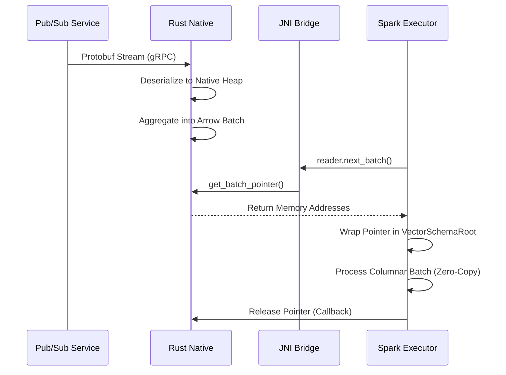

# System Architecture: The "Split-Brain" Connector

This document explains how the Spark Pub/Sub Connector achieves high-performance ingestion by splitting its work between two different programming worlds: **The JVM (Scala)** and **The Native Data Plane (Rust)**.

---

## 1. The Bottleneck: Why Native?

Traditional Spark connectors live entirely inside the JVM. When you read 1GB of data from Pub/Sub every second, the JVM creates millions of "garbage" objects to hold that data. This causes the **Garbage Collector (GC)** to run constantly, leading to "Stop-the-World" pauses that freeze your ingestion.

**Our Approach**:
We offload the "Hot Path" (fetching, buffer management, and parsing) to Rust. Rust doesn't use a garbage collector, so memory usage is deterministic and efficient.

---

## 2. High-Level Design

We use a "Split-Brain" architecture:

1.  **Spark Control Plane (Scala/JVM)**:
    - Acts as the "Brain".
    - Negotiates schemas with Spark Catalyst.
    - Decides how many parallel tasks to run.
    - Handles offsets and transaction commits.
2.  **Native Data Plane (Rust)**:
    - Acts as the "Muscles".
    - Opens multiple gRPC connections to Pub/Sub.
    - Buffers data in native, off-heap memory.
    - Converts Protobuf into Columnar Arrow format.

### The Bridges
- **JNI (Java Native Interface)**: The bridge for commands (e.g., "Start fetching", "Give me a batch").
- **Arrow C Data Interface**: The high-speed bridge for data. POK (Pointers over Knowledge) allows Spark to read Rust's memory directly without copying.

---

## 3. The Zero-Copy Data Flow

Here is how a single byte of data reaches Spark:

---

## 4. Key Components

### 4.1. The Tokio Runtime (`pubsub.rs`)
The connector hosts a persistent, async Rust runtime.
- **Dynamic Threads**: It automatically scales the number of background threads based on the hardware it's running on (`available_parallelism`).
- **Pre-fetching**: It pulls data even while Spark is busy processing the previous batch, keeping the pipeline full.

### 4.2. Off-Heap Ack Reservoir
Pub/Sub uses **Ack IDs** instead of offsets.
- When messages arrive in Rust, their IDs are stored in a native `ACK_RESERVOIR`.
- These IDs stay off-heap, so the JVM never sees them.
- When Spark commits a micro-batch, it sends a signal to Rust to "Ack all these messages at once."

### 4.3. Native Schema Projection (`builder.rs`)
If you define a schema in Spark (`df.readStream.schema(...)`), the native layer will:
1.  Parse JSON or Avro bytes directly in Rust.
2.  Project only the requested columns.
3.  Fill the Arrow arrays immediately.
*This means the JVM never even sees the raw JSON bytes.*

---

## 5. Memory Safety

Interfacing two languages is dangerous (null pointers, double-frees). We use **FFI Protection Barriers**:
- **Panic Protection**: Every C-level call is wrapped in a "catch_unwind" barrier. If Rust crashes, it throws a standard Java Exception instead of killing the whole Spark node.
- **Explicit Ownership**: We use the official `arrow-rs` FFI abstractions. The native memory is only freed after Spark calls the `release` callback provided by Arrow.

---

## 6. Consistency Model

We implement **At-Least-Once** semantics:
- Messages are only acknowledged to Pub/Sub *after* the Spark Driver confirms the micro-batch has been committed to the checkpoint.
- If an Executor crashes, the native reader dies, and Pub/Sub will automatically redeliver the unacknowledged messages to a different Executor.
