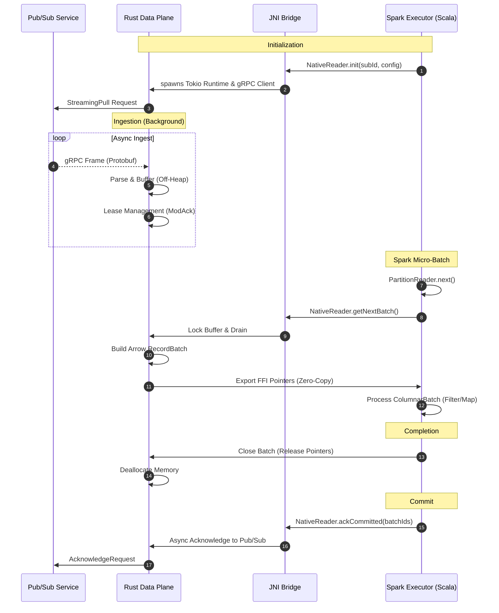
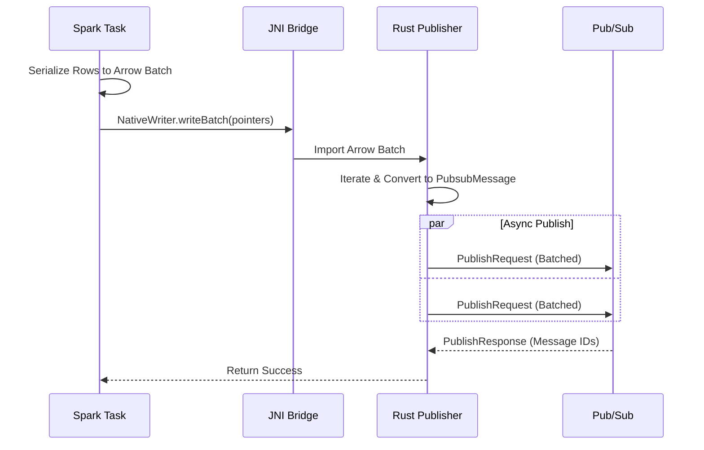

# System Architecture: The "Split-Brain" Connector

This document details the architectural design of the Spark Pub/Sub Connector. It explains how we achieve gigabyte-scale throughput by splitting responsibilities between the **Spark JVM (Scala)** and a **Native Data Plane (Rust)**.

---

## 1. High-Level Design

We use a "Split-Brain" architecture to bypass the impedance mismatch between Spark's batch-oriented model and Pub/Sub's streaming protocol.

### 1.1 The "Two Brains"
| Component | Language | Role | Key Responsibilities |
| :--- | :--- | :--- | :--- |
| **Control Plane** | Scala (JVM) | The "Brain" | Queries, Schema Inference, Task Scheduling, Offset Management, Transaction Commits. |
| **Data Plane** | Rust (Native) | The "Muscle" | gRPC I/O, Protocol Buffer Parsing, Memory Allocation, Lease Management, Flow Control. |

### 1.2 The Bridges
1.  **JNI (Java Native Interface)**: Used for *Control Signals* (e.g., "Start fetching", "Commit this batch").
2.  **Arrow C Data Interface**: Used for *Data Transport*. Allows Spark to read Rust-allocated memory directly ("Zero-Copy").

---

## 2. Detailed Dataflow (Read Path)

The following diagram illustrates the lifecycle of a message from Pub/Sub to Spark.

```mermaid
sequenceDiagram
    autonumber
    participant P as Pub/Sub Service
    participant R as Rust Data Plane
    participant J as JNI Bridge
    participant S as Spark Executor (Scala)

    Note over R,S: Initialization
    S->>J: NativeReader.init(subId, config)
    J->>R: spawns Tokio Runtime & gRPC Client
    R->>P: StreamingPull Request

    Note over R: Ingestion (Background)
    loop Async Ingest
        P-->>R: gRPC Frame (Protobuf)
        R->>R: Parse & Buffer (Off-Heap)
        R->>R: Lease Management (ModAck)
    end

    Note over S: Spark Micro-Batch
    S->>S: PartitionReader.next()
    S->>J: NativeReader.getNextBatch()
    J->>R: Lock Buffer & Drain
    R->>R: Build Arrow RecordBatch
    R->>S: Export FFI Pointers (Zero-Copy)
    S->>S: Process ColumnarBatch (Filter/Map)
    
    Note over S: Completion
    S->>R: Close Batch (Release Pointers)
    R->>R: Deallocate Memory
    
    Note over S: Commit
    S->>J: NativeReader.ackCommitted(batchIds)
    J->>R: Async Acknowledge to Pub/Sub
    R->>P: AcknowledgeRequest
```

### 2.1 Key Design Definitions

#### The Global Tokio Runtime
Spark Executors process multiple tasks (partitions) concurrently. Starting a new Async Runtime for every task is inefficient.
- **Implementation**: We use a `lazy_static` Global Runtime in Rust.
- **Isolation**: Each Spark Task gets a unique `partition_id` and registers its own client/buffer in a global Registry (`CLIENT_REGISTRY`), allowing tasks to share the runtime threads while keeping state isolated.

#### Offset Management (Synthetic Offsets)
Pub/Sub has no sequential offsets. Spark needs offsets.
- **Our Solution**: We generate monotonic `BatchId`s in Scala.
- **Mapping**: Rust maintains a `BATCH_ACK_MAP` linking `BatchId` -> `List<AckId>`.
- **Commit**: When Spark calls `commit(offset)`, we look up the AckIds in Rust and flush them to Pub/Sub.

---

## 3. The Zero-Copy Memory Model

To achieve >100 MB/s/core, we cannot afford to copy data between Rust and Java.

### 3.1 The Arrow C Interface
We use the [Apache Arrow C Data Interface](https://arrow.apache.org/docs/format/CDataInterface.html) to exchange data.

1.  **Allocation**: Rust allocates data using `jemalloc` (to avoid fragmentation).
2.  **Export**: Rust fills `FFI_ArrowArray` structs with pointers to this memory.
3.  **Import**: Scala wraps these pointers in `VectorSchemaRoot` objects.
4.  **Access**: Spark's `ArrowColumnVector` reads directly from these off-heap memory addresses.

### 3.2 FFI Safety Barriers
Interfacing C/Rust with Java is dangerous. We implement strict barriers:
- **Panic Safety**: All JNI calls are wrapped in `safe_jni_call` (using `std::panic::catch_unwind`). A Rust panic becomes a Java `RuntimeException`, preventing the JVM from crashing.
- **Alignment Checks**: We verify pointer alignment before dereferencing.
- **Ownership**: We strictly follow Arrow's release callback protocol to ensure memory is freed only when Spark is done with it.

---

## 4. Implementation Details

### 4.1 Package Structure
- **Scala**: `finalconnector` (e.g., `finalconnector.NativeReader`).
- **Rust**: `crate::source_jni` maps to `finalconnector.NativeReader`.

### 4.2 Handling Schemas
- **JSON**: Parsed using `serde_json` directly into Arrow builders.
- **Protobuf/Avro**: (Roadmap) Will use dynamic reflection (`prost-reflect`) to map binary schemas to Arrow without code generation.

### 4.3 Flow Control & Backpressure
We rely on the `google-cloud-pubsub` crate's internal flow control:
- **Max Messages**: Limits un-acked messages per partition.
- **Backpressure**: If the Rust buffer fills up (Spark is slow), we stop pulling from gRPC, naturally propagating backpressure to the server.

---

## 5. Write Path (Sink)

The Sink architecture focuses on high-throughput publishing.

```mermaid
sequenceDiagram
    participant S as Spark Task
    participant J as JNI Bridge
    participant R as Rust Publisher
    participant P as Pub/Sub

    S->>S: Serialize Rows to Arrow Batch
    S->>J: NativeWriter.writeBatch(pointers)
    J->>R: Import Arrow Batch
    R->>R: Iterate & Convert to PubsubMessage
    
    par Async Publish
        R->>P: PublishRequest (Batched)
    and
        R->>P: PublishRequest (Batched)
    end
    
    P-->>R: PublishResponse (Message IDs)
    R-->>S: Return Success
```

**Key Optimizations**:
- **Batching**: We use `BatchingConfig` to aggregate small messages into ~9MB requests (just under the 10MB limit).
- **Concurrency**: We use `tokio::spawn` to drive thousands of concurrent publish futures.

---

## 6. References
- **Source Code**:
  - `native/src/lib.rs`: JNI Entry Points.
  - `native/src/core/client.rs`: Pub/Sub Client Wrapper.
  - `spark/src/main/scala/finalconnector/NativeReader.scala`: Scala JNI Definition.

---
**Transparency Note**: This project was significantly accelerated by an Agentic AI (Google DeepMind). Code and documentation contain AI-generated content verified by human engineering.
