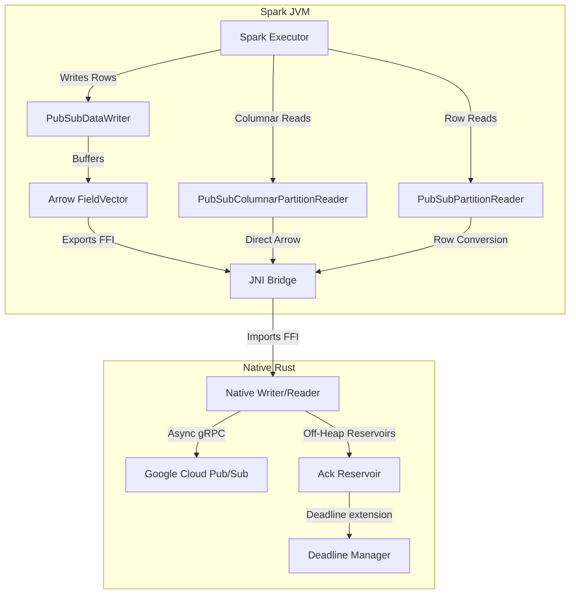

# Spark Pub/Sub Connector Architecture

## 1. System Overview
The Spark Pub/Sub Connector is a high-performance, native integration between Apache Spark (Structured Streaming) and Google Cloud Pub/Sub. It leverages **Apache Arrow** and **Rust** to achieve near-zero-copy data transfer and low-latency message processing.

### Key Goals
- **High Throughput**: Bypasses the JVM Pub/Sub client in favor of a native Rust `tonic` (gRPC) implementation.
- **Zero-Copy Serialization**: Uses the **Arrow C Data Interface** (FFI) to pass data between the JVM (Spark) and Native (Rust) layers without expensive serialization/deserialization steps.
- **Type Safety**: Centralized type mapping guarantees consistency between Spark SQL types and Arrow vectors.

### Stability & Scale
Detailed design constraints for reliability and scaling are defined in [Stability and Scale Design Guidelines](stability_and_scale_guidelines.md).

---

## 2. High-Level Architecture
The system employs a "split-brain" approach:

1.  **Spark Control Plane (Scala/JVM)**:
    - Implements Spark's `DataSourceV2` API.
    - Handles query planning, partition management, metrics, and schema inference.
    - Manages the lifecycle of native resources via JNI.

2.  **Native Data Plane (Rust)**:
    - Executes heavy I/O operations (Pub/Sub Publish/Subscribe) on a `tokio` runtime.
    - Manages gRPC connections and authentication (ADC).
    - Converts Protobuf messages to Arrow Interface structures (`FFI_ArrowArray`, `FFI_ArrowSchema`).

### Component Interaction Diagram

---

## 3. Core Modules & Flows

### 3.1. Read Path (Spark -> Pub/Sub)
**Classes**: `PubSubMicroBatchStream`, `PubSubPartitionReader`, `PubSubColumnarPartitionReader`
**Flow**:
1.  **Planning**: `PubSubMicroBatchStream` defines input partitions and propagates commit signals (Batch IDs) to executors.
2.  **Execution**: Readers initialize a `NativeReader` via JNI.
3.  **Fetch**:
    - `reader.getNextBatch` is called with a `batchId`.
    - Rust performs a `StreamingPull` from Pub/Sub.
    - Rust stores `ack_ids` in a **subscription-aware Native Reservoir**.
    - Rust converts `PubsubMessage`s into an `Arrow StructArray`.
    - Rust exports the array pointer via the C Data Interface.
4.  **Consumption**:
    - **Vectorized Reader**: Imports the pointer and wraps vectors in `ArrowColumnVector` for zero-copy processing in Spark.
    - **Standard Reader**: Iterates over Arrow increments and creates Spark `InternalRow`s.
5.  **Signal Propagation (Ack-on-Commit)**:
    - On batch commit, Spark sends a batch ID signal.
    - In the next planning cycle, this signal is passed to all executor tasks.
    - Executors call `ackCommitted`, which flushes `ack_ids` from the Native Reservoir for the committed batches.

### 3.2. Write Path (Pub/Sub -> Spark)
**Class**: `PubSubDataWriter`
**Flow**:
1.  **Buffering**: Rows are written to `PubSubDataWriter`, which buffers them into local Arrow `FieldVector`s using `ArrowUtils.setValue`.
2.  **Flush**: When the buffer is full (configured batch size), `writeBatch` is invoked.
3.  **Export**:
    - Scala exports the local Arrow Vector to a C-compatible struct (`FFI_ArrowArray`).
    - **Critical**: Scala calls `close()` on the local root, while Rust takes a reference.
4.  **Publish**:
    - Rust imports the FFI struct via **transmuted Mirrors** (bypassing `arrow-rs` strict pointer layouts for compatibility).
    - Rust converts Arrow batches to `PubsubMessage`s via `ArrowBatchReader`.
    - Messages are published asynchronously via an internal MPSC channel in `PublisherClient`.
    - **Reliability**: A synchronous flush is performed on `close()` to prevent data loss (The "Async Gap").
    - Panic protection (`catch_unwind`) ensures JNI errors don't crash the JVM.

---

## Decision Log & Technical Constraints

### 1. FFI Ownership Model (Reference Counting)
We determined that Java's Arrow implementation uses **Reference Counting** ("Shared" semantics) for exports, rather than strict "Move" semantics (zeroing pointers).
- **Strategy**: The generic lifecycle involves balancing reference counts across the boundary.
    - **Java**: Allocate -> Export -> Call `close()` (Decrements 1 local ref).
    - **Rust**: Import (Increments ref) -> Process -> Drop (Decrements ref).

### 2. Centralized Type Mapping (`ArrowUtils.scala`)
All type conversions are centralized in `ArrowUtils.scala` to ensure consistency between Read/Write paths.

### 3. Build Structure (Version Focused)
The project identifies compatible Spark versions via dedicated sub-modules:
- **`spark33`**: Targets Spark 3.3.4 (Scala 2.12).
- **`spark35`**: Targets Spark 3.5.0 (Scala 2.12) - Primary Target.
- **`spark40`**: Targets Spark 4.0.0-preview2 (Scala 2.13).
